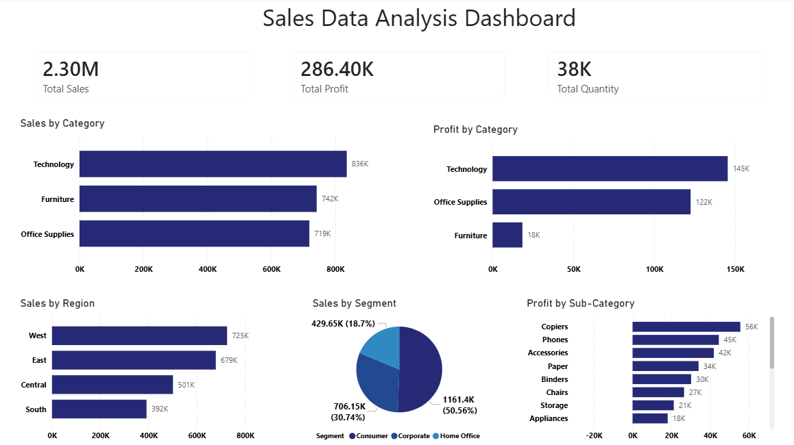

# 📊 Sales Analytics Dashboard

## Overview
An interactive Power BI dashboard designed to analyze sales performance, revenue trends, customer insights, and key business metrics.

## Features
- Sales performance analysis
- Revenue and profit tracking
- KPI monitoring
- Regional and category-wise insights
- Interactive filters and visualizations

## Tools Used
- Power BI
- Microsoft Excel
- Data Visualization

## Skills
- Power BI
- Data Analysis
- Data Visualization
- Dashboard Design
- KPI Reporting
- Microsoft Excel

## Dashboard Preview

## Project File
- Sales Analysis.pbix

## Author
Hemshree Bhagavathi S
